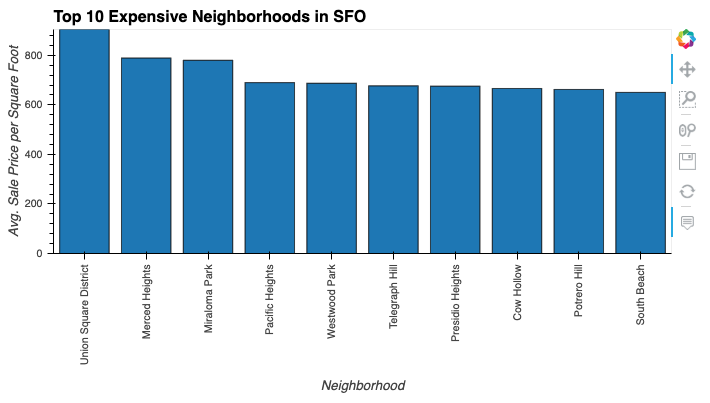
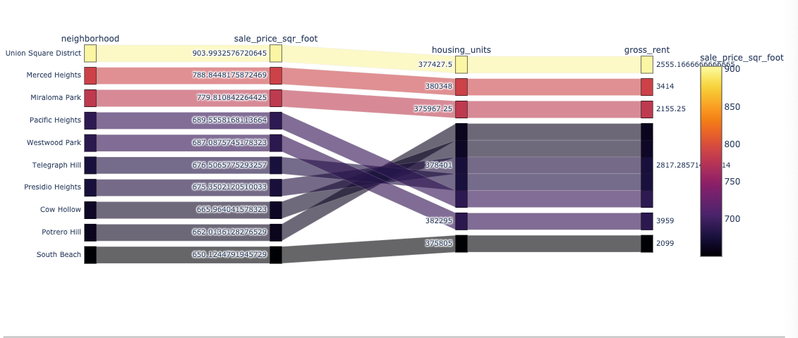

# Data Analysis and Visualization of San Francisco Real Estate Market

# Description

San Francisco real estate data from 2010 to 2016 is analyzed. A simple dashboard is created summarizing the results. This dashboard has four tabs. There are two charts in each tab.

Tabs:

**Tab 1. Yearly Unit and Rent Data** 

    Chart 1 - Shows housing unit trends

    Chart 2 - Shows gross rent trends

**Tab 2. Avg Sales Prices**

    Chart 1 - Shows average sales prices per square foot.
    
    

    Chart 2 - Shows average sales prices per square foot by neighborhood.(Use dropdown menu to select neighborhood.) 
   

**Tab 3. Top 10 Neighborhoods and Map**

    Chart 1 - Shows the top 10 most expensive neighborhoods.

    Chart 2 - Shows map of neighborhoods along with sales prices and rents.

**Tab 4. Parallel** (These charts are interactive)

    Chart 1 - Parallel Coordinates plot for mulivariate analysis

    Chart 2 - Parallel Categories plot for multivariate analysis

